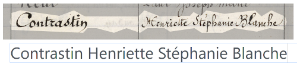
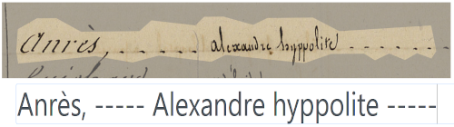

# lectaurep-mariages-et-divorces

<!-- badges HUMGenerator -->

## Contexte de production 

Le projet [LECTAUREP](https://lectaurep.hypotheses.org/) (LECTure Automatique de REPertoires), qui a débuté en 2018, est une initiative conjointe du Minutier central des notaires de Paris des Archives Nationales, de l’équipe ALMAnaCH (Automatic Language Modeling and Analysis &amp; Computational Humanities) à Inria et de l’EPHE (Ecole Pratique des Hautes Etudes), en partenariat avec le Ministère de la Culture.

Le projet vise à repenser l’utilisation actuellement faite des registres des actes notariés, l’une des sources historiques les plus consultées aux Archives nationales, par les chercheurs et les utilisateurs des fonds d’archives notariales. Pour ce faire, le projet a instaurer un workflow de traitement de ces manuscrits à l’aide de la reconnaissance automatique des documents manuscrits (HTR) et d'extraction d’information (NER) en adoptant notamment l'application eScriptorium pour produire la vérité de terrain, entraîner des modèles de reconnaissance et corriger les transcriptions résultants.

Les corpus `lectaurep-mariages-et-divorces` rassemblent 104 numérisations double-pages issues principalement des enregistrements des Contrats de Mariage de commerçant par tenus par la [Chambre des Notaires de Paris](https://www.siv.archives-nationales.culture.gouv.fr/siv/rechercheconsultation/consultation/producteur/consultationProducteur.action?notProdId=FRAN_NP_050648&withoutContext=true) depuis 1803. 

Une petite partie de ce corpus correspond également aux enregistrements des jugements de séparation de corps ou de biens et divorces, toujours par la Chambre des Notaires de Paris, cette fois depuis 1892.

:arrow_right: voir la [fiche détaillée des enregistrements des contrats de mariage de commerçant à Paris](https://www.siv.archives-nationales.culture.gouv.fr/siv/rechercheconsultation/consultation/ir/consultationIR.action?formCaller=&irId=FRAN_IR_50229&gotoArchivesNums=false&defaultResultPerPage=&frontIr=&optionFullText=&fullText=&udId=&consIr=&details=false&page=&auSeinIR=false)

:arrow_right: voir la [fiche détaillée des enregistrements des jugements de séparation de corps ou de biens et divorces à Paris](https://www.siv.archives-nationales.culture.gouv.fr/siv/rechercheconsultation/consultation/ir/consultationIR.action?formCaller=&irId=FRAN_IR_056926&gotoArchivesNums=false&defaultResultPerPage=&frontIr=&optionFullText=&fullText=&udId=&consIr=&details=false&page=&auSeinIR=false)

## Détail des lots

| Nom             | Importance matérielle | Dates extremes    | Particularité | CM ou SD\* | Identifiant db |
| --------------- | --------------------- | ----------------- | ------------- | -------- | -------------- |
| lectaurep-cm1   | 30 doubles-pages      | 04/1829 - 10/1829 | 1 seule main  | CM/1     | [#152](https://escriptorium.inria.fr/document/152/images/) |
| lectaurep-cm3   | 30 doubles-pages      | 03-1836 - 08-1836 | 1 seule main  | CM/3     | [#267](https://escriptorium.inria.fr/document/267/images/) |
| lectaurep-cm-sd | 44 doubles-pages      | 1829, 1832, 1836, 1838, 1839, 1841, 1844, 1846, 1850, 1852, 1854, 1855, 1862, 1864, 1866, 1868, 1870, 1872, 1875, 1877, 1879, 1881, 1883, 1885, 1887, 1889, 1891, 1892, 1893, 1895, 1896, 1897, 1898, 1899, 1900, 1903, 1909, 1927, 1928 | échantillonnages par carottage | CM + SD | [#603](https://escriptorium.inria.fr/document/603/images/) |

> \*CM=Contrat de mariage; SD=Séparation et Divorces

## Règles de transcription

- la segmentation suit globalement la structure tabulaire, à l'exception des "Noms" et "Prénoms" qui sont systématiquement segmentés comme appartenant à la même colonne. Une série de ` ..... ` ou ` ---- `, quand elle est présente sur l'image, signale la séparation entre "nom" et "prénom". 

- le texte suscrit a été signalé par un `^` liminaire. Le phénomène "**dudt**" (dudit) est donc transcrit par "dud^t".

- l'emploi des minuscules et majuscule a été respecté.

- les signatures sont systématiquement transcrites par un `¥`. Tous les segments contenant des signatures et des paraphes (en général ils ne contiennent rien d'autre) ont été associés au type "Signature".

- les portions de texte pré-imprimées, notamment les en-têtes des tableaux et les préambules ont été transcrits. Les segments concernés ont été associés au type "printed".

---

<!-- logo institutionnels -->

| Inria                               | Archives nationales                                             |
| :---------------------------------: | :-------------------------------------------------------------: |
|  |  |

